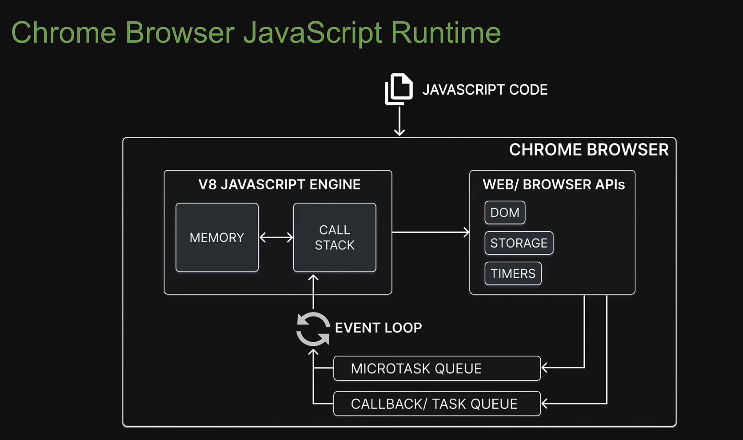
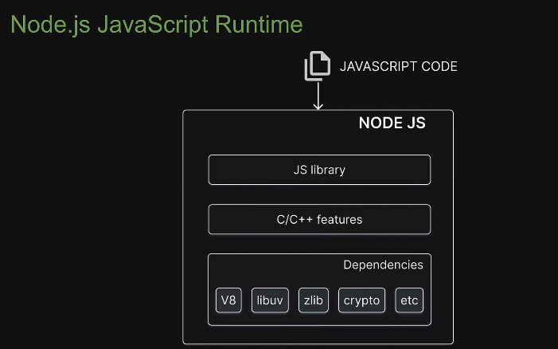

# advance Nodejs


### 1.browser javascript runtime



### 2.Nodejs runtime



### 3.Modules

1.local modules: Modules that we create in our application.

2.Built-in modules: Modules that Node.js ships with out of the box.

3.Third party modules:Modules written by other developers that we can use in our application

#### 4.Each loaded module in Node.js is wrapped with an IIFE that provides private scoping of code .

#### IIFE allows you to repeat variable or function names without any conflicts.

```js
(function(){
    //Module code actually lives in here
})()
```

#### 5.Module Wrapper 

```js
(function(exports,require,module,__filename,__dirname){
    
})()
```

#### 6.Module cache

在同一个文件中，加载过的module，会被缓存起来，即使再次引入，也不会再次解析执行，如果引入的是一个对象，则会共享这个对象。

#### 7.import JSON data

```js
const data = require("./data.json")
```

引入JSON的时候，会自动解析成javascript对象

### 8.built-in module

#### 1.path

`const path = require('node:path');`

**`path.join(...paths)`**：将所有给定的路径片段连接到一个规范化的路径中。

```js
const path = require('node:path');

const filePath = path.join(__dirname, 'files', 'example.txt');
console.log(filePath);
```

**`path.resolve(...paths)`**：将所有给定的路径片段解析为绝对路径。

```js
const path = require('path');

const absolutePath = path.resolve('src', 'index.js');
console.log(absolutePath);
```

**`path.basename(path[, ext])`**：返回 `path` 的最后一部分，类似于 Unix 的 `basename` 命令。

```js
const path = require('path');

const fileName = path.basename('/path/to/file.txt');
console.log(fileName); // 输出：'file.txt'
```

**`path.dirname(path)`**：返回 `path` 的目录名。

```js
const path = require('path');

const directory = path.dirname('/path/to/file.txt');
console.log(directory); // 输出：'/path/to'
```

**`path.extname(path)`**：返回 `path` 的扩展名。

```js
const path = require('path');

const extName = path.extname('/path/to/file.txt');
console.log(extName); // 输出：'.txt'
```

**`path.parse(pathString)`**：返回一个对象，其中包含 `pathString` 的解析结果。

```js
const path = require('path');

const pathInfo = path.parse('/path/to/file.txt');
console.log(pathInfo);
```

#### 2.Event

在 Node.js 中，`events` 模块用于处理事件的创建和触发。以下是一些常用的方法和使用示例：

1. **`EventEmitter` 类**：`EventEmitter` 类用于处理事件的触发和监听。

   ```js
   const EventEmitter = require('events');
   
   // 创建一个 EventEmitter 实例
   const myEmitter = new EventEmitter();
   
   // 监听 'event' 事件
   myEmitter.on('event', () => {
     console.log('an event occurred!');
   });
   
   // 触发 'event' 事件
   myEmitter.emit('event');
   ```

2. **`on(eventName, listener)`**：监听特定事件。

   ```js
   myEmitter.on('status', (status) => {
     console.log(`Server status: ${status}`);
   });
   ```

3. **`emit(eventName[, ...args])`**：触发特定事件。

   ```js
   myEmitter.emit('status', 'running');
   ```

4. **`once(eventName, listener)`**：监听特定事件，但只触发一次。

   ```js
   myEmitter.once('onceEvent', () => {
     console.log('This event will only be triggered once');
   });
   ```

5. **`removeListener(eventName, listener)`**：移除事件的监听器。

   ```js
   const listener = () => {
     console.log('This listener will be removed');
   };
   
   myEmitter.on('remove', listener);
   myEmitter.removeListener('remove', listener);
   ```

6. **`removeAllListeners([eventName])`**：移除所有或特定事件的监听器。

   ```js
   myEmitter.removeAllListeners('remove');
   ```

7. **`listenerCount(eventName)`**：获取特定事件的监听器数量。

   ```js
   console.log(myEmitter.listenerCount('event'));
   ```

#### 3.fs

#### 在 Node.js 中，`fs` 模块提供了同步（Synchronous）和异步（Asynchronous）两种操作文件的方式。这两种方式在使用上有一些区别：

1. **同步操作**：同步操作会阻塞 Node.js 事件循环，直到操作完成后才会继续执行后续代码。同步方法的命名通常以 `Sync` 结尾，如 `readFileSync`、`writeFileSync` 等。

   ```js
   const fs = require('node:fs');
   
   // 同步读取文件
   try {
     const data = fs.readFileSync('example.txt', 'utf8');
     console.log(data);
   } catch (err) {
     console.error(err);
   }
   
   console.log('After reading file');
   ```

2. **异步操作**：异步操作不会阻塞事件循环，而是在操作完成后通过回调函数来处理结果。异步方法的命名通常不以 `Sync` 结尾，如 `readFile`、`writeFile` 等。

   ```js
   const fs = require('node:fs');
   
   // 异步读取文件
   fs.readFile('example.txt', 'utf8', (err, data) => {
     if (err) {
       console.error(err);
       return;
     }
     console.log(data);
   });
   
   console.log('After reading file');
   ```


在 Node.js 的 `fs` 模块中，可以使用以下方法来写文件：

1. **异步写文件**：使用 `fs.writeFile` 方法进行异步写文件操作。

   ```js
   const fs = require('fs');
   
   fs.writeFile('example.txt', 'Hello, World!', 'utf8', (err) => {
     if (err) {
       console.error(err);
       return;
     }
     console.log('File written successfully');
   });
   ```

2. **同步写文件**：使用 `fs.writeFileSync` 方法进行同步写文件操作。

   ```js
   const fs = require('fs');
   
   try {
     fs.writeFileSync('example.txt', 'Hello, World!', 'utf8');
     console.log('File written successfully');
   } catch (err) {
     console.error(err);
   }
   ```

在这两种方法中，第一个参数是要写入的文件路径，第二个参数是要写入的内容，第三个参数是编码（可选，默认为 'utf8'），第四个参数是写入完成后的回调函数（仅在异步方法中可用）。


1. **`fs.appendFile(file, data[, options], callback)`**：追加数据到文件末尾。

   ```js
   const fs = require('fs');
   
   fs.appendFile('example.txt', '\nAppended content', 'utf8', (err) => {
     if (err) throw err;
     console.log('Data appended to file');
   });
   ```

2. **`fs.readdir(path[, options], callback)`**：读取目录内容。

   ```js
   const fs = require('fs');
   
   fs.readdir('./', (err, files) => {
     if (err) throw err;
     console.log('Files in the directory:');
     files.forEach(file => {
       console.log(file);
     });
   });
   ```

3. **`fs.rename(oldPath, newPath, callback)`**：重命名文件或目录。

   ```js
   const fs = require('fs');
   
   fs.rename('old.txt', 'new.txt', (err) => {
     if (err) throw err;
     console.log('File renamed successfully');
   });
   ```

4. **`fs.unlink(path, callback)`**：删除文件。

   ```js
   const fs = require('fs');
   
   fs.unlink('file.txt', (err) => {
     if (err) throw err;
     console.log('File deleted');
   });
   ```

5. **`fs.stat(path, callback)`**：获取文件信息。

   ```js
   const fs = require('fs');
   
   fs.stat('example.txt', (err, stats) => {
     if (err) throw err;
     console.log('File information:');
     console.log(stats);
   });
   ```

##### 使用 `fs.writeFile` 方法，并将 `flag` 参数设置为 `'a'`，这样可以实现追加内容到文件的效果。例如：

```js
const fs = require('fs');

fs.writeFile('example.txt', 'New content\n', { flag: 'a' }, (err) => {
  if (err) {
    console.error(err);
    return;
  }
  console.log('Content appended successfully');
});
```

Node.js 的 `fs` 模块中的方法并不直接返回 Promise，但可以通过 `util.promisify` 方法将其转换为返回 Promise 的方法。以下是一些常用的方法和使用案例：

1. **异步写文件**：使用 `fs.promises.writeFile` 方法进行异步写文件操作。

   ```js
   //const fs = require('fs').promises;
   //const fs = require('fs/promises');
   
   fs.writeFile('example.txt', 'Hello, World!', 'utf8')
     .then(() => {
       console.log('File written successfully');
     })
     .catch((err) => {
       console.error(err);
     });
   ```

2. **异步读文件**：使用 `fs.promises.readFile` 方法进行异步读文件操作。

   ```js
   //const fs = require('fs').promises;
   //const fs = require('fs/promises');
   
   fs.readFile('example.txt', 'utf8')
     .then((data) => {
       console.log('File content:', data);
     })
     .catch((err) => {
       console.error(err);
     });
   ```

3. **异步追加文件内容**：使用 `fs.promises.appendFile` 方法进行异步追加文件内容操作。

   ```js
   //const fs = require('fs').promises;
   //const fs = require('fs/promises');
   
   fs.appendFile('example.txt', '\nNew content', 'utf8')
     .then(() => {
       console.log('Content appended successfully');
     })
     .catch((err) => {
       console.error(err);
     });
   ```

#### stream

##### 读取文件：

```js
const fs = require('fs');

// 创建可读流
const readableStream = fs.createReadStream('input.txt');

// 设置编码为 utf8
readableStream.setEncoding('utf8');

// 处理流事件 --> data, end, and error
readableStream.on('data', function(chunk) {
    console.log(chunk);
});

readableStream.on('end',function() {
    console.log('文件读取完毕');
});

readableStream.on('error', function(err) {
    console.log(err.stack);
});
```

`fs.createReadStream` 方法接受的参数如下：

1. `path`：要打开的文件的路径。

2. options

   ：一个可选的对象，用于指定可读流的行为。常见的选项包括：

   - `flags`：指定文件打开的行为，默认为 `'r'`。
   - `encoding`：指定用于解析文件的编码，默认为 `null`。
   - `fd`：文件描述符，指定要打开的文件。
   - `mode`：设置文件模式（权限和文件类型），默认为 `0o666`。
   - `autoClose`：是否在读取结束后自动关闭文件，默认为 `true`。
   - `start`：开始读取的位置（以字节为单位）。
   - `end`：结束读取的位置（以字节为单位）。
   - `highWaterMark`：每次读取的字节数，默认为 64 KB。

示例代码如下：

```js
onst fs = require('fs');

const readableStream = fs.createReadStream('example.txt', { encoding: 'utf8', start: 0, end: 100 });
```

在这个示例中，`createReadStream` 方法将会读取 `example.txt` 文件的前 100 个字节，并使用 `utf8` 编码解析文件内容。

##### 写入文件：

```js
const fs = require('fs');

const data = '写入文件的内容';

// 创建一个可以写入的流，写入到文件 output.txt 中
const writableStream = fs.createWriteStream('output.txt');

// 使用 utf8 编码写入数据
writableStream.write(data, 'utf8');

// 标记文件末尾
writableStream.end();

// 处理流事件 --> finish, and error
writableStream.on('finish', function() {
    console.log('写入完成。');
});

writableStream.on('error', function(err){
   console.log(err.stack);
});
```

`fs.createWriteStream` 方法接受的参数如下：

1. `path`：要写入的文件的路径。

2. options

   ：一个可选的对象，用于指定可写流的行为。常见的选项包括：

   - `flags`：指定文件打开的行为，默认为 `'w'`。
   - `encoding`：指定用于写入文件的编码，默认为 `utf8`。
   - `mode`：设置文件模式（权限和文件类型），默认为 `0o666`。
   - `autoClose`：是否在写入结束后自动关闭文件，默认为 `true`。
   - `start`：写入的起始位置（以字节为单位）。
   - `emitClose`：是否在关闭文件时发出 `close` 事件，默认为 `false`。

示例代码如下：

```js
const fs = require('fs');

const writableStream = fs.createWriteStream('example.txt', { flags: 'a', encoding: 'utf8' });
```


```js
const fs = require('fs');

// 创建可读流
const readableStream = fs.createReadStream('input.txt');

// 创建可写流
const writableStream = fs.createWriteStream('output.txt');

// 读取数据并写入文件
readableStream.pipe(writableStream);

// 处理流事件 --> finish, and error
writableStream.on('finish', function() {
    console.log('数据写入完成。');
});

writableStream.on('error', function(err){
   console.error(err);
});
```

`zlib` 模块提供了压缩和解压缩数据的功能。常用的方法包括：

1. `zlib.deflate(input, callback)`：压缩数据，`input` 是要压缩的数据，`callback` 是压缩完成后的回调函数。
2. `zlib.inflate(input, callback)`：解压数据，`input` 是要解压的数据，`callback` 是解压完成后的回调函数。
3. `zlib.gzip(input, callback)`：使用 GZIP 格式压缩数据，`input` 是要压缩的数据，`callback` 是压缩完成后的回调函数。
4. `zlib.gunzip(input, callback)`：解压 GZIP 格式的数据，`input` 是要解压的数据，`callback` 是解压完成后的回调函数。
5. `zlib.deflateRaw(input, callback)`：使用 RAW 格式压缩数据，`input` 是要压缩的数据，`callback` 是压缩完成后的回调函数。
6. `zlib.inflateRaw(input, callback)`：解压 RAW 格式的数据，`input` 是要解压的数据，`callback` 是解压完成后的回调函数。
7. `zlib.unzip(input, callback)`：解压缩数据，自动检测并解压缩 GZIP、RAW 或 ZLIB 格式的数据，`input` 是要解压的数据，`callback` 是解压完成后的回调函数。

这些方法中的 `input` 参数可以是 `Buffer` 或 `TypedArray` 类型的数据，也可以是一个文件路径。完成后的数据会通过回调函数返回，如果需要将数据保存到文件中，可以使用 `fs` 模块的文件操作方法。

`zlib.createGzip()` 是 Node.js 中 `zlib` 模块提供的用于创建 Gzip 压缩流的方法。它可以将数据流通过 Gzip 压缩算法进行压缩，通常用于将大文件或数据流压缩为较小的文件或数据流，以减少网络传输或磁盘空间的占用。

示例用法如下：

```js
const zlib = require('zlib');
const fs = require('fs');

const input = fs.createReadStream('input.txt');
const output = fs.createWriteStream('input.txt.gz');

// 创建 Gzip 压缩流
const gzip = zlib.createGzip();

// 将输入流通过 Gzip 压缩后写入输出流
input.pipe(gzip).pipe(output);

// 可以在结束时监听压缩完成事件
output.on('finish', () => {
  console.log('File successfully compressed.');
});
```

在这个示例中，`zlib.createGzip()` 创建了一个 Gzip 压缩流，并通过 `input.pipe(gzip).pipe(output);` 将输入流中的数据通过 Gzip 压缩后写入到输出流中。最终将生成一个名为 `input.txt.gz` 的压缩文件。

### 4.http

1. 创建 HTTP 服务器：

```js
const http = require('http');

const server = http.createServer((req, res) => {
  res.statusCode = 200;
  res.setHeader('Content-Type', 'text/plain');
  res.end('Hello, World!\n');
});

server.listen(3000, '127.0.0.1', () => {
  console.log('Server running at http://127.0.0.1:3000/');
});
```

  2.发起 HTTP 请求：

```js
const http = require('http');

const options = {
  hostname: 'www.example.com',
  port: 80,
  path: '/',
  method: 'GET'
};

const req = http.request(options, (res) => {
  console.log(`STATUS: ${res.statusCode}`);
  console.log(`HEADERS: ${JSON.stringify(res.headers)}`);
  res.setEncoding('utf8');
  res.on('data', (chunk) => {
    console.log(`BODY: ${chunk}`);
  });
  res.on('end', () => {
    console.log('No more data in response.');
  });
});

req.on('error', (e) => {
  console.error(`problem with request: ${e.message}`);
});

req.end();
```

return json

```js
const http = require('http');

const server = http.createServer((req, res) => {
  res.statusCode = 200;
  res.setHeader('Content-Type', 'application/json');
  const jsonData = { message: 'Hello, World!' };
  res.end(JSON.stringify(jsonData));
});

server.listen(3000, '127.0.0.1', () => {
  console.log('Server running at http://127.0.0.1:3000/');
});
```


`UV_THREADPOOL_SIZE` 是 Node.js 中用于控制 libuv 线程池大小的环境变量。libuv 是 Node.js 的底层库，用于处理异步 I/O 操作。线程池是为了提高异步操作的性能而引入的概念，它可以让多个异步操作并发执行。

默认情况下，Node.js 的 libuv 线程池大小是 4。这意味着，在进行异步 I/O 操作时，最多会有 4 个线程同时执行。如果应用程序中有大量的异步操作，并且希望提高性能，可以考虑调整 `UV_THREADPOOL_SIZE` 的值来增加线程池的大小。

需要注意的是，增加线程池大小并不总是能够提高性能，因为线程数量过多可能会带来额外的开销和竞争条件。调整线程池大小时，应根据具体情况进行测试和评估。

### 5.Network   I/O

```javascript
const https = require("https");
const start = Date.now();
const MAX_CALLS = 12;
for (let i = 0; i < MAX_CALLS; i++) {
  https
    .request("https://www.google.com", (res) => {
      res.on("data", () => {});
      res.on("end", () => {
        console.log(`Request: ${i + 1}`, Date.now() - start);
      });
    })
    .end();
}
```

网络I/O不使用libuv的thread pool,使用操作系统的内核的机制

In Node.js,async methods are handled by libuv in two different ways.

1. Native async mechanism   
2. Thread pool

Whenever possible,Libuv will use native async mechanisms in the OS so as to avoid blocking the main thread,this is part of the kernel,there is different mechanism for each OS. we have epoll for Linux,Kqueue for MacOS and IO Completion Port for Windows.

使用Thread pool 的场景

1.文件系统操作

2.压缩和解压操作

3.加密和解密操作

## event loop


timer,I/O,check and close are part of Libuv,but nextTick and promise are not part of Libuv.

1. All user written synchronous Javascript code takes priority over asnyc code that the runtime would like  to eventually execute.

```javascript
console.log("console.log 1");
process.nextTick(() => console.log("this is process.nextTick 1"));
console.log("console.log 2");
```

2.all callbacks in nextTick queue are executed before all callbacks in promise queue.

```javascript
process.nextTick(() => console.log("this is process.nextTick 1"));
process.nextTick(() => {
  console.log("this is process.nextTick 2");
  process.nextTick(() => console.log("this is the inner next tick inside next tick"));
});
process.nextTick(() => console.log("this is process.nextTick 3"));

Promise.resolve().then(() => console.log("this is Promise.resolve 1"));
Promise.resolve().then(() => {
  console.log("this is Promise.resolve 2");
  process.nextTick(() => console.log("this is the inner next tick inside Promise then block"));
});
Promise.resolve().then(() => console.log("this is Promise.resolve 3"));
----------------------------
output:
this is process.nextTick 1
this is process.nextTick 2
this is process.nextTick 3
this is the inner next tick inside next tick
this is Promise.resolve 1
this is Promise.resolve 2
this is Promise.resolve 3
this is the inner next tick inside Promise then block
```

3.microtask queues are executed before timer queue

```javascript
setTimeout(() => console.log("this is setTimeout 1"), 0);
setTimeout(() => console.log("this is setTimeout 2"), 0);
setTimeout(() => console.log("this is setTimeout 3"), 0);

process.nextTick(() => console.log("this is process.nextTick 1"));
process.nextTick(() => {
  console.log("this is process.nextTick 2");
  process.nextTick(() => consol.log("this is the inner next tick inside next tick"));
});
process.nextTick(() => console.log("this is process.nextTick 3"));

Promise.resolve().then(() => console.log("this is Promise.resolve 1"));
Promise.resolve().then(() => {
  console.log("this is Promise.resolve 2");
  process.nextTick(() => console.log("this is the inner next tick inside Promise then block")
  );
});
Promise.resolve().then(() => console.log("this is Promise.resolve 3"));

---------------------------------
output:
this is process.nextTick 1
this is process.nextTick 2
this is process.nextTick 3
this is the inner next tick inside next tick
this is Promise.resolve 1
this is Promise.resolve 2
this is Promise.resolve 3
this is the inner next tick inside Promise then block
this is setTimeout 1
this is setTimeout 2
this is setTimeout 3
```

4.microtask queues are executed in between timer queue callbacks.

```javascript
setTimeout(() => console.log("this is setTimeout 1"), 0);
setTimeout(() => {
  console.log("this is setTimeout 2");
  process.nextTick(
    console.log.bind(console, "this is the inner next tick inside setTimeout")
  );
}, 0);
setTimeout(() => console.log("this is setTimeout 3"), 0);

process.nextTick(() => console.log("this is process.nextTick 1"));
process.nextTick(() => {
  console.log("this is process.nextTick 2");
  process.nextTick(
    console.log.bind(console, "this is the inner next tick inside next tick")
  );
});
process.nextTick(() => console.log("this is process.nextTick 3"));

Promise.resolve().then(() => console.log("this is Promise.resolve 1"));
Promise.resolve().then(() => {
  console.log("this is Promise.resolve 2");
  process.nextTick(
    console.log.bind(
      console,
      "this is the inner next tick inside Promise then block"
    )
  );
});
Promise.resolve().then(() => console.log("this is Promise.resolve 3"));
--------------------
output:
this is process.nextTick 1
this is process.nextTick 2
this is process.nextTick 3
this is the inner next tick inside next tick
this is Promise.resolve 1
this is Promise.resolve 2
this is Promise.resolve 3
this is the inner next tick inside Promise then block
this is setTimeout 1
this is setTimeout 2
this is the inner next tick inside setTimeout
this is setTimeout 3
```

5.timer queue callbacks are executed in FIFO order

```javascript
setTimeout(() => console.log("this is setTimeout 1"), 1000);
setTimeout(() => console.log("this is setTimeout 2"), 500);
setTimeout(() => console.log("this is setTimeout 3"), 0);
---------------
output:
this is setTimeout 3
this is setTimeout 2
this is setTimeout 1
```

6.Microtask queues callbacks are executed before I/O queue callbacks

```javascript
const fs = require("fs");

fs.readFile(__filename, () => {
  console.log("this is readFile 1");
});

process.nextTick(() => console.log("this is process.nextTick 1"));
Promise.resolve().then(() => console.log("this is Promise.resolve 1"));
----------------
output:
this is process.nextTick 1
this is Promise.resolve 1
this is readFile 1
```

7.when running setTimeout with delay 0ms and  an I/O async method. the order of execution can never be guaranteed 

```javascript
const fs = require("fs");

setTimeout(() => console.log("this is setTimeout 1"), 0);

fs.readFile(__filename, () => {
  console.log("this is readFile 1");
});
-----------------
output:
this is setTimeout 1
this is readFile 1
```

8.I/O queue callbacks are executed after Microtask queues callbacks and Timer queue callbacks are executed

```javascript
const fs = require("fs");

fs.readFile(__filename, () => {
  console.log("this is readFile 1");
});

process.nextTick(() => console.log("this is process.nextTick 1"));
Promise.resolve().then(() => console.log("this is Promise.resolve 1"));
setTimeout(() => console.log("this is setTimeout 1"), 0);

for (let i = 0; i < 1000000000; i++) {}
output:
this is process.nextTick 1
this is Promise.resolve 1
this is setTimeout 1
this is readFile 1
```

9.I/O events are polled and callbacks are added only after I/O is complete

```javascript
const fs = require("fs");

fs.readFile(__filename, () => {
  console.log("this is readFile 1");
});

process.nextTick(() => console.log("this is process.nextTick 1"));
Promise.resolve().then(() => console.log("this is Promise.resolve 1"));
setTimeout(() => console.log("this is setTimeout 1"), 0);
setImmediate(() => console.log("this is setImmediate 1"));

for (let i = 0; i < 2000000000; i++) {}
-------------------
output:
this is process.nextTick 1
this is Promise.resolve 1
this is setTimeout 1
this is setImmediate 1
this is readFile 1
```

10.Check queue callbacks are executed after Microtask queues callbacks, Timer queue callbacks and I/O queue callbacks are executed

```javascript
const fs = require("fs");

fs.readFile(__filename, () => {
  console.log("this is readFile 1");
  setImmediate(() => console.log("this is inner setImmediate inside readFile"));
});

process.nextTick(() => console.log("this is process.nextTick 1"));
Promise.resolve().then(() => console.log("this is Promise.resolve 1"));
setTimeout(() => console.log("this is setTimeout 1"), 0);

for (let i = 0; i < 2000000000; i++) {}
-----------------------
output:
this is process.nextTick 1
this is Promise.resolve 1
this is setTimeout 1
this is readFile 1
this is inner setImmediate inside readFile
```

11.Microtask queues callbacks are executed after I/O callbacks and before check queue callbacks

```javascript
const fs = require("fs");

fs.readFile(__filename, () => {
  console.log("this is readFile 1");
  setImmediate(() => console.log("this is inner setImmediate inside readFile"));
  process.nextTick(() => console.log("this is inner process.nextTick inside readFile"));
  Promise.resolve().then(() => console.log("this is inner Promise.resolve inside readFile"));
});

process.nextTick(() => console.log("this is process.nextTick 1"));
Promise.resolve().then(() => console.log("this is Promise.resolve 1"));
setTimeout(() => console.log("this is setTimeout 1"), 0);

for (let i = 0; i < 2000000000; i++) {}
----------------------
output:
this is process.nextTick 1
this is Promise.resolve 1
this is setTimeout 1
this is readFile 1
this is inner process.nextTick inside readFile
this is inner Promise.resolve inside readFile
this is inner setImmediate inside readFile

```

12.Microtask queues callbacks are executed in between check queue callbacks

```javascript
setImmediate(() => console.log("this is setImmediate 1"));
setImmediate(() => {
  console.log("this is setImmediate 2");
  process.nextTick(() => console.log("this is process.nextTick 1"));
  Promise.resolve().then(() => console.log("this is Promise.resolve 1"));
});
setImmediate(() => console.log("this is setImmediate 3"));
------------------
output:
this is setImmediate 1
this is setImmediate 2
this is process.nextTick 1
this is Promise.resolve 1
this is setImmediate 3
```

13.Timer anamoly. Order of execution can never be guaranteed

```javascript
setTimeout(() => console.log("this is setTimeout 1"), 0);
setImmediate(() => console.log("this is setImmediate 1"));
---------------
output
PS D:\js-space\Nodejs\src\node-fundamentals> node .\event-loop.js
this is setImmediate 1
this is setTimeout 1
PS D:\js-space\Nodejs\src\node-fundamentals> node .\event-loop.js
this is setTimeout 1
this is setImmediate 1
```


```javascript
setTimeout(() => console.log("this is setTimeout 1"), 0);
setImmediate(() => console.log("this is setImmediate 1"));
// Uncomment below to guarantee order
for (let i = 0; i < 1000000000; i++) {}

--------------------
output:
this is setTimeout 1
this is setImmediate 1
```

14.Close queue callbacks are executed after all other queues callbacks

```javascript
const fs = require("fs");

const readableStream = fs.createReadStream(__filename);
readableStream.close();

readableStream.on("close", () => {
  console.log("this is from readableStream close event callback");
});
setImmediate(() => console.log("this is setImmediate 1"));
setTimeout(() => console.log("this is setTimeout 1"), 0);
Promise.resolve().then(() => console.log("this is Promise.resolve 1"));
process.nextTick(() => console.log("this is process.nextTick 1"));
-----------------
output:
this is process.nextTick 1
this is Promise.resolve 1
this is setTimeout 1
this is setImmediate 1
this is from readableStream close event callback
```


